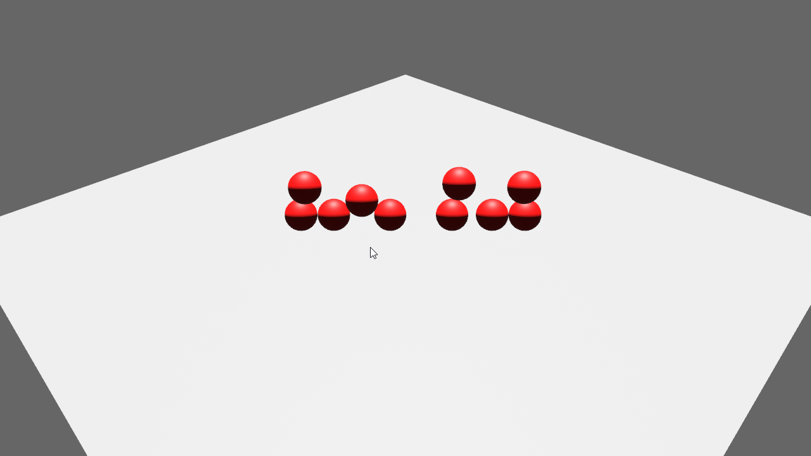

<div align="center">

# Bevy Rewind 

A plugin for easily rewinding time in [Bevy](https://github.com/bevyengine/bevy)

[](https://github.com/bevyengine/bevy/blob/main/docs/plugins_guidelines.md#main-branch-tracking)
[](https://github.com/LiamGallagher737/bevy_rewind/actions)
[](https://github.com/LiamGallagher737/bevy_rewind)
[](https://crates.io/crates/bevy_rewind)
[](https://docs.rs/bevy_rewind)

</div>


# [Demo](examples/demo.rs)

Demo of rewinding using bevy_rapier, tap <kbd>Space</kbd> to toggle rewinding

```console
cargo run --example demo 
```

<div align="center">
    
</div>


# Setup

Add the plugin to your app
```rust
.add_plugin(RewindPlugin::default())
```

Config Options

```rust
RewindPlugin {
    // How many captures will take place before they start clearing,
    // default is 300 for 5 seconds of replay.
    // (60 ticks per seconds * 5 seconds)
    max_capture_count: 300,
    // If the game should stop rewinding once any of the components has run out of history.
    cancel_on_empty_history: false, 
}
```


# Usage

To track a components value add the `RewindComponent<C>` to the entity with C being the component you want to track, in this example the entities `Transform` will be tracked for rewinding.

```rust
commands.spawn((
    PbrBundle::default(),
    RewindComponent::<Transform>::default(),
));
```

By default only `Transform` and `GlobalTransform` components can be tracked, to add support for more use the `init_rewind_component<C>` method on your app where C is the component you want to be able to track.

```rust
App::new()
    .add_plugin(RewindPlugin)
    .init_rewind_component::<Velocity>()
    .run();
```


# Bevy Tracking

|Bevy|bevy_rewind|
|---|---|
|0.10|0.1.0|


# License

All code in this repository is dual-licensed under either:

* MIT License ([LICENSE-MIT](LICENSE-MIT) or [http://opensource.org/licenses/MIT](http://opensource.org/licenses/MIT))
* Apache License, Version 2.0 ([LICENSE-APACHE](LICENSE-APACHE) or [http://www.apache.org/licenses/LICENSE-2.0](http://www.apache.org/licenses/LICENSE-2.0))

at your option. This means you can select the license you prefer! This dual-licensing approach is the de-facto standard in the Rust ecosystem and there are [very good reasons](https://github.com/bevyengine/bevy/issues/2373) to include both.

Unless you explicitly state otherwise, any contribution intentionally submitted for inclusion in the work by you, as defined in the Apache-2.0 license, shall be dual licensed as above, without any additional terms or conditions.
